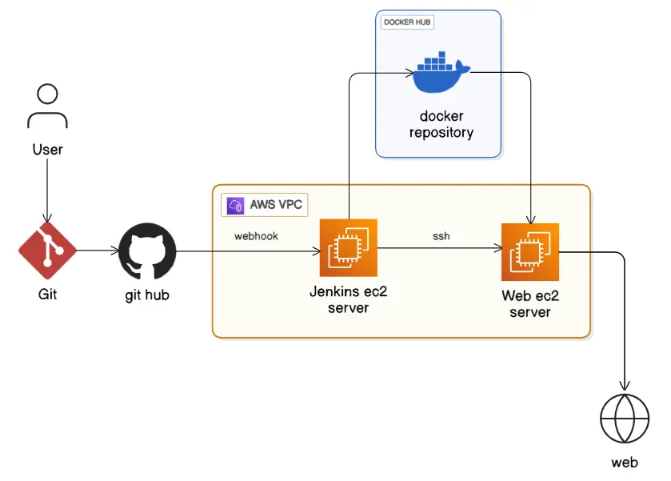

    Service Status Dashboard – CI/CD Monitoring Project

 
📌 Project Overview

This project is a lightweight CI/CD Service Status Dashboard that provides a single-click view of the latest deployment status instead of checking multiple tools like Jenkins manually.

It answers key questions instantly:

What is the latest build number?

Which version is deployed?

When was the last deployment?

Is the application UP or DOWN?

The dashboard is automatically updated by Jenkins during the CI/CD pipeline and deployed using Docker on AWS EC2.

🧠 Problem Statement

In real CI/CD workflows:

Jenkins shows build details, but not in one place

Checking build number, version, deploy time is time-consuming

Beginners often struggle to understand what is currently deployed

👉 This project solves that by providing a simple web dashboard that always shows the latest deployment state.

 High-Level Architecture

Flow Summary:

Developer pushes code to GitHub

GitHub Webhook triggers Jenkins

Jenkins:

Builds the application

Builds Docker image

Pushes image to Docker Hub

Updates deployment info via API

Web EC2: pulls latest Docker image

Dashboard displays updated deployment data

⚙️ CI/CD Flow (End to End)
CI – Continuous Integration

GitHub Webhook triggers Jenkins automatically

Jenkins pipeline runs stages:

Source checkout

Dependency installation

Docker image build

Docker image push to Docker Hub

Each successful build updates:

Build number

Version

Deployment time

CD – Continuous Deployment

Web EC2 pulls the latest Docker image

Old container is stopped

New container is started

Dashboard reflects the latest deployment instantly

📊 Dashboard Capabilities

Shows Application Status (UP/DOWN)

Displays latest build number

Displays latest version

Shows last deployment time

Updates automatically after each successful Jenkins build

🔑 Key Commands Used
(Only essential commands)

Jenkins Management

Used to manage the Jenkins service on the CI server.

-sudo systemctl start jenkins
-sudo systemctl restart jenkins
-sudo systemctl status jenkins

Docker Image Lifecycle

Used during the CI process to build and publish the application image.

-docker build -t snesh111/service-status-dashboard:latest .

before pushing the image login to the dockerhub 

-docker push snesh111/service-status-dashboard:latest

Deployment on Web EC2

Used to deploy the latest application version on the server.

-docker pull snesh111/service-status-dashboard:latest
-docker stop service-status && docker rm service-status
-docker run -d -p 80:5000 --name service-status snesh111/service-status-dashboard:latest

Application Runtime Verification

Used to verify application status after deployment.

-docker ps

These commands are executed either manually during initial setup or automatically as part of the Jenkins CI/CD pipeline.

🎯 What I Learned From This Project
CI/CD Concepts

How GitHub Webhooks trigger Jenkins automatically

Difference between manual builds vs automated pipelines

How Jenkins pipelines are structured stage-by-stage

Docker & Deployment

Building production-ready Docker images

Tagging and pushing images to Docker Hub

Containerized deployment on AWS EC2

Zero-downtime container replacement approach

AWS & Infrastructure

Using multiple EC2 instances for separation of concerns

Security group configuration (ports, inbound rules)

Understanding public IP changes and service accessibility

✅ Final Takeaway

This project demonstrates my ability to design and implement a real-world CI/CD pipeline using industry-standard tools.
It shows how automated builds, containerized deployments, and cloud infrastructure work together to provide clear deployment visibility

Overall, this project strengthened my understanding of practical CI/CD workflows and how deployment status is monitored in real environments.

🚀 Future Enhancements 

Automatic health checks for application status

Auto-rollback on failed deployments

Authentication for deployment update API

Deployment history tracking

Kubernetes-based deployment

🔚 End of README